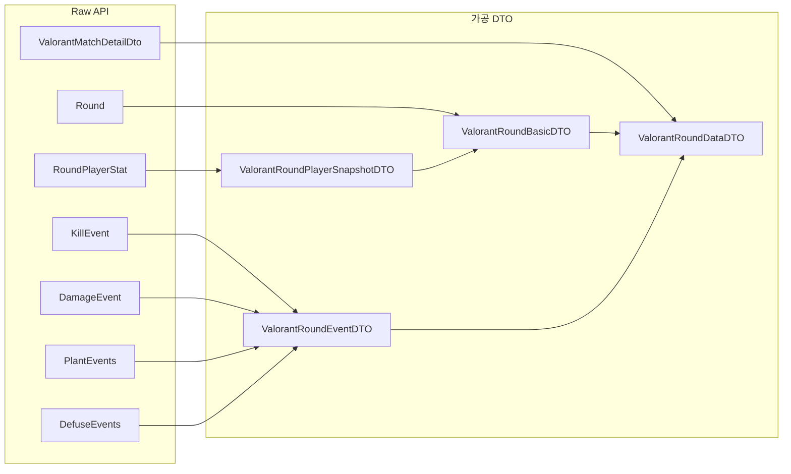

# Valorant 라운드 데이터 구조 설계 계획

## 목적

데이터 가공 엔진 문서에 정의된 대로, AI 분석 시 필요한 **라운드별 구매 상황, 데스 타임라인, 스킬 활용 기록**을 제공하기 위해, 라운드 데이터를 다음 두 축으로 분리합니다:

1. **기본 데이터**: 라운드 메타 + 각 유저의 로드아웃·승패·집계 스탯
2. **이벤트**: 시간순 킬, 플랜트, 디퓨즈, 데미지(교전)

---

## 현재 구조 vs 제안 구조

### 데이터 흐름




### 기존 DTO와의 역할


| 구분          | 기존                                                                                                  | 제안                                                   |
| ----------- | --------------------------------------------------------------------------------------------------- | ---------------------------------------------------- |
| 플레이어 라운드 스탯 | [ValorantRoundStatsDTO](src/main/java/com/gamematcher/dto/ai/evaluation/ValorantRoundStatsDTO.java) | **ValorantRoundPlayerSnapshotDTO**로 역할 통합 (basic 내부) |
| 라운드 메타      | 없음                                                                                                  | **ValorantRoundBasicDTO**에 winningTeam, endType 등 추가 |
| 타임라인 이벤트    | 없음                                                                                                  | **ValorantRoundEventDTO**로 킬/플랜트/디퓨즈/데미지 시퀀스화        |
| 라운드 전체      | 없음                                                                                                  | **ValorantRoundDataDTO** = basic + events            |


---

## DTO 상세 설계

### 1. ValorantRoundBasicDTO

라운드 결과 및 플레이어별 스냅샷(구매, 승패, 집계 스탯).

```java
// 대상 패키지: com.gamematcher.dto.ai.evaluation
int roundIndex;
String winningTeam;
String endType;           // "Bomb detonated", "Eliminated", "Defuse" 등
boolean bombPlanted;
boolean bombDefused;

List<ValorantRoundPlayerSnapshotDTO> playerSnapshots;
```

### 2. ValorantRoundPlayerSnapshotDTO

[ValorantRoundStatsDTO](src/main/java/com/gamematcher/dto/ai/evaluation/ValorantRoundStatsDTO.java)와 유사하지만, Basic 전용으로 위치·역할을 명확히 함. 기존 필드 유지.

```java
String puuid, playerDisplayName, playerTeam;
int loadoutValue, economySpent, economyRemaining;
boolean roundWon;
int damage, kills, headshots, bodyshots, legshots;
int abilityXCasts, abilityECasts, abilityQCasts, abilityCCasts;
boolean wasAfk, stayedInSpawn;
boolean gotFirstBlood, wasFirstDeath;
```

### 3. ValorantRoundEventDTO

시간순 이벤트를 하나의 DTO로 표현. `eventType`으로 구분.

```java
// 공통
String eventType;         // "KILL", "PLANT", "DEFUSE", "DAMAGE"
int timeInRound;          // ms

// KILL
String killerPuuid, victimPuuid;
String weaponName;
List<String> assistantPuuids;

// PLANT
String plantedByPuuid;
String plantSite;
// plantTimeInRound == timeInRound

// DEFUSE
String defusedByPuuid;
// defuseTimeInRound == timeInRound

// DAMAGE (교전 단위)
String attackerPuuid, receiverPuuid;
int damage;
int headshots, bodyshots, legshots;
```

### 4. ValorantRoundDataDTO

라운드 전체 = 기본 데이터 + 정렬된 이벤트 리스트.

```java
ValorantRoundBasicDTO basic;
List<ValorantRoundEventDTO> events;  // timeInRound 기준 오름차순
```

---

## Raw API 소스 매핑

[ValorantMatchDetailDto](src/main/java/com/gamematcher/dto/valorant/ValorantMatchDetailDto.java) 기준:


| 제안 DTO 필드                 | Raw 소스                                               |
| ------------------------- | ---------------------------------------------------- |
| basic.roundIndex          | rounds 인덱스                                           |
| basic.winningTeam         | Round.winningTeam                                    |
| basic.endType             | Round.endType                                        |
| basic.bombPlanted/Defused | Round.bombPlanted, bombDefused                       |
| playerSnapshots           | Round.playerStats → RoundEconomy, damage, kills 등    |
| events (KILL)             | RoundPlayerStat.killEvents (라운드별)                    |
| events (PLANT)            | Round.plantEvents                                    |
| events (DEFUSE)           | Round.defuseEvents                                   |
| events (DAMAGE)           | RoundPlayerStat.damageEvents (attacker는 playerPuuid) |


**주의**: `damageEvents`는 receiver 기준이므로, `RoundPlayerStat`을 순회해 attacker(playerPuuid) → receiver 구조로 매핑해야 함.

---

## 교전(Engagement) 처리 전략

**Phase 1**: `damageEvents`를 그대로 `timeInRound` 기준 시퀀스로 변환  

- 구현 난이도 낮음  
- 모든 피해 기록 유지  
- AI가 타임라인으로 교전 흐름 파악 가능

**Phase 2** (선택): A→B, B→A 등 상호 피해를 묶어 "교전" 단위로 가공  

- First Blood, 클러치 등 시그널 추출 용이  
- 로직이 복잡해지므로 Phase 1 검증 후 진행

---

## 구현 순서

1. **DTO 클래스 생성**
  - `ValorantRoundPlayerSnapshotDTO`
  - `ValorantRoundBasicDTO`
  - `ValorantRoundEventDTO` (eventType enum 또는 상수 활용)
  - `ValorantRoundDataDTO`
2. **Mapper/Converter 작성**
  - `ValorantMatchDetailDto.Round` → `ValorantRoundDataDTO` 변환
  - `RoundPlayerStat` → `ValorantRoundPlayerSnapshotDTO`
  - `KillEvent`, `PlantEvents`, `DefuseEvents`, `DamageEvent` → `ValorantRoundEventDTO` 리스트
  - `timeInRound` 기준 정렬
3. **ValorantRoundStatsDTO 관계 정리**
  - 기존 클래스 유지 vs `ValorantRoundPlayerSnapshotDTO`로 대체 여부 결정
  - 통합 시 기존 참조부 수정
4. **통합 테스트**
  - `valorant_match_sample.json` 기반 변환 검증
  - events 정렬 및 basic 데이터 일치 확인

---

## 파일 경로


| 작업     | 경로                                                                       |
| ------ | ------------------------------------------------------------------------ |
| 새 DTO  | `src/main/java/com/gamematcher/dto/ai/evaluation/`                       |
| Mapper | `src/main/java/com/gamematcher/mapper/ValorantRoundDataMapper.java` (신규) |
| 테스트    | `src/test/java/com/gamematcher/mapper/ValorantRoundDataMapperTest.java`  |


