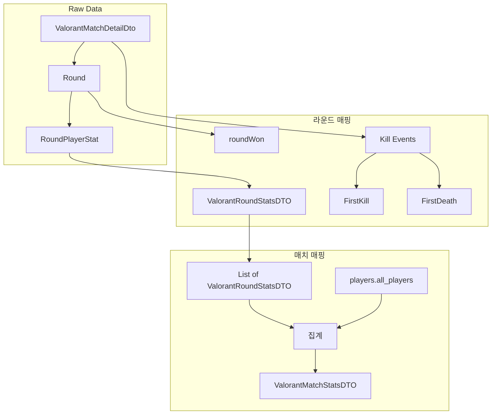

# 발로란트 전적 → 스탯 DTO 매핑 가이드

## 데이터 계층 구조

```
Kill Event ( valorant_one_kill_sample.json )
    → 단일 킬 기록

Player Stat in Round ( valorant_player_stat_in_one_round.json )
    → 1라운드 내 1명의 결과 (economy, damage, kill_events 포함)

Round ( valorant_one_round_sample.json )
    → winning_team, end_type + player_stats[10]

Match ( valorant_match_sample.json )
    → metadata, players, teams + rounds[] + kills[]
```

---

## 1. ValorantRoundStatsDTO 매핑 (라운드×플레이어)

**소스**: `Round.playerStats[i]` (RoundPlayerStat) + `Round.winningTeam` + 킬 이벤트

| ValorantRoundStatsDTO 필드 | 소스 | 비고 |
|---------------------------|------|------|
| roundIndex | rounds 배열 인덱스 | 0-based |
| roundWon | `Round.winningTeam == RoundPlayerStat.playerTeam` | 해당 플레이어 팀 승리 여부 |
| playerPuuid | RoundPlayerStat.player_puuid | |
| died | 마지막 킬의 player_locations_on_kill 생존 여부 | 상위 ValorantPlayerMatchStatsDTO에 중복이므로 제거됨: playerDisplayName, playerTeam |
| damage | RoundPlayerStat.damage | |
| totalShots | headshots + bodyshots + legshots | 계산 |
| headShots | RoundPlayerStat.headshots | |
| bodyShots | RoundPlayerStat.bodyshots | |
| legShots | RoundPlayerStat.legshots | |
| kills | RoundPlayerStat.kills | |
| score | RoundPlayerStat.score | |
| loadoutValue | RoundPlayerStat.economy.loadout_value | |
| economyRemaining | RoundPlayerStat.economy.remaining | |
| economySpent | RoundPlayerStat.economy.spent | |
| skillXCasts | RoundPlayerStat.ability_casts.x_casts | null → 0 |
| skillECasts | RoundPlayerStat.ability_casts.e_casts | null → 0 |
| skillQCasts | RoundPlayerStat.ability_casts.q_casts | null → 0 |
| skillCCasts | RoundPlayerStat.ability_casts.c_casts | null → 0 |
| Afk | RoundPlayerStat.was_afk | |
| Penalized | RoundPlayerStat.was_penalized | |
| stayedInSpawn | RoundPlayerStat.stayed_in_spawn | |
| FirstKill | **계산** | 아래 로직 |
| FirstDeath | **계산** | 아래 로직 |

### FirstKill / FirstDeath 계산 로직

라운드 내 **가장 먼저 발생한 킬**을 기준으로:

- **FirstKill**: `kill_time_in_round`가 최소인 킬의 `killer_puuid` == 해당 플레이어
- **FirstDeath**: `kill_time_in_round`가 최소인 킬의 `victim_puuid` == 해당 플레이어

**데이터 소스** (둘 중 하나):

- `Round.playerStats[*].kill_events` — 라운드별 킬 (round 필드 없을 수 있음)
- `Match.kills` — `round == roundIndex` 인 항목만 필터

---

## 2. ValorantMatchStatsDTO 매핑 (매치×플레이어)

**소스**: `Match.players.all_players` + `Match.teams` + `Match.rounds` (집계용)

### 2-1. 직접 매핑 (players.all_players 또는 rounds 집계)

| ValorantMatchStatsDTO 필드 | 소스 | 비고 |
|----------------------------|------|------|
| roundsPlayed | metadata.rounds_played | |
| roundsWon | teams.red/blue 중 플레이어 팀의 rounds_won | 플레이어 팀 판별 후 |
| kills | players.all_players[].stats.kills | 또는 rounds 집계 |
| deaths | players.all_players[].stats.deaths | 또는 kill 이벤트에서 victim 횟수 |
| assists | players.all_players[].stats.assists | API에 damaged/noDamage 구분 없을 수 있음 |
| totalShots | headshots + bodyshots + legshots | |
| headShots | players.all_players[].stats.headshots | |
| bodyShots | players.all_players[].stats.bodyshots | |
| legShots | players.all_players[].stats.legshots | |
| result | teams에서 플레이어 팀 has_won | MatchResult.WIN/LOSS |

### 2-2. damagedAssists / noDamageAssists

API에 분리된 필드가 없으면:

- **damagedAssists**: `DamageEvent`에서 receiver가 킬당한 경우, attacker를 assist로 집계 (복잡)
- **noDamageAssists**: `KillEvent.assistants` 중 damage_events에 없는 puuid
- **간단화**: 둘 다 0 또는 assists 전체를 damagedAssists에 넣고 noDamageAssists=0

### 2-3. 파생 지표 (계산)

| 필드 | 계산식 |
|------|--------|
| kd | deaths > 0 ? kills / deaths : kills |
| headShotRate | totalShots > 0 ? (headShots / totalShots) * 100 : 0 |
| bodyShotRate | totalShots > 0 ? (bodyShots / totalShots) * 100 : 0 |
| legShotRate | totalShots > 0 ? (legShots / totalShots) * 100 : 0 |
| adr | roundsPlayed > 0 ? (라운드별 damage 합) / roundsPlayed : 0 |
| avgDamageDifference | roundsPlayed > 0 ? (라운드별 damage_dealt - damage_received) / roundsPlayed : 0 |

### 2-4. KAST (Kill, Assist, Survived, Traded)

각 라운드에서 다음 중 하나면 "기여":

- **Kill**: 킬 participation
- **Assist**: 어시스트 participation (damageEvents 또는 assistants)
- **Survived**: 라운드 생존
- **Traded**: 킬당한 후 킬한 플레이어가 5초 내에 킬당함

**계산**: `(기여한 라운드 수 / roundsPlayed) * 100`

**세이지 부활(Traded 판정 개선)**: 한 라운드에 여러 번 죽을 수 있음(세이지 부활 후 재사망).  
모든 데스를 검사하여 **하나라도 traded면** 해당 라운드는 KAST T로 인정. (`ValorantMatchStatsMapper.isTradedInRound`)

### 2-5. First Blood / First Death

- **firstBloods**: FirstKill == true 인 라운드 수
- **firstDeaths**: FirstDeath == true 인 라운드 수

`List<ValorantRoundStatsDTO>`에서 해당 플레이어의 round별 FirstKill/FirstDeath 집계.

### 2-6. 멀티킬 지표

라운드별 `kills`를 기준으로:

- **doubleKill**: 한 라운드에 2킬
- **tripleKill**: 한 라운드에 3킬
- **quadraKill**: 4킬
- **pentaKill**: 5킬
- **overKill**: 6킬 이상
- **multiKill**: 2킬 이상 (double + triple + quadra + penta + over)

---

## 3. 구현 흐름 요약



---

## 4. 구현 순서 제안

1. **ValorantRoundStatsMapper** (또는 Converter)
   - `(Round, roundIndex) → List<ValorantRoundStatsDTO>`
   - RoundPlayerStat → ValorantRoundStatsDTO 매핑
   - FirstKill/FirstDeath 계산 (kill_events 또는 match.kills 활용)

2. **ValorantMatchStatsMapper**
   - `ValorantMatchDetailDto → List<ValorantMatchStatsDTO>` (플레이어별)
   - 1번을 각 round에 대해 호출해 라운드 스탯 리스트 생성
   - players + 라운드 스탯 집계 → ValorantMatchStatsDTO
   - kd, headShotRate, adr, kast, firstBloods, multiKill 등 계산

3. **테스트**
   - `valorant_match_sample.json` → `ValorantMatchDetailDto` 파싱
   - 1라운드 → List<ValorantRoundStatsDTO> 검증
   - 전체 매치 → List<ValorantMatchStatsDTO> 검증
