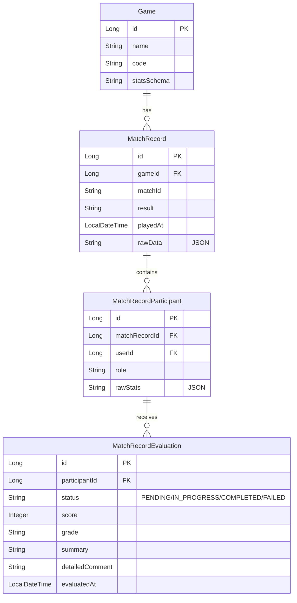

# AI 전적 분석·평가 기능 구현 계획

## 0. 실행 개요 (AI 구현 가이드)

| Phase | 의존성 | 목표 |
|-------|--------|------|
| 1 | - | 프로젝트 기본 설정 정리 |
| 2 | 1 | 도메인 엔티티 + DTO/Repository (JSON 변환 구조 선행) |
| 3 | 2 | GameAnalyzer 전략 패턴으로 규칙 기반 점수·등급 |
| 4 | 2, 3 | LLM API + JSON 응답 파싱 + Fallback |
| 5 | 2, 3, 4 | AIEvaluationService 통합, 비동기 트리거 |
| 6 | 5 | Controller, OpenAPI, 팀 연동 포인트 |

**패키지 경로**: `com.gamematcher` ( entity | repository | service.ai | controller | dto.stats )

---

## 1. 핵심 제약 사항 (반드시 준수)

### ✓ 필수

- **Phase 2 선행**: `rawStats`용 DTO 구조(`BaseStatsDTO`, 게임별 DTO, `StatsConverter`)를 엔티티보다 먼저 확립. 이 구조 없이 진행 시 추후 전면 수정 필요.
- **전략 패턴**: 게임별 분석 로직은 `GameAnalyzer` 인터페이스 + 구현체(`ValorantAnalyzer`, `LolAnalyzer` 등)로 분리. `RuleBasedScoreService` 단일 클래스 + if-else/switch 분기 **금지**.
- **LLM Response Format 강제**: 프롬프트에서 `{"summary":"...","detailedComment":"..."}` 형태로 응답 형식 명시 후 파싱 → DTO 매핑.
- **LLM Fallback**: LLM 실패(타임아웃, 할당량 등) 시 규칙 기반 점수·등급만이라도 반환. `summary`/`detailedComment`는 null 또는 기본 문구.

### ✗ 금지

- `rawStats`를 단순 JSON 문자열로만 저장하고 매번 파싱하는 방식
- 게임별 로직을 한 클래스에서 if-else/switch로 분기하는 방식
- LLM에 "평가해줘"만 요청하고 응답 형식을 강제하지 않는 방식
- LLM 실패 시 전체 실패로 두는 방식 (Fallback 없음)

---

## 2. 기술 스택 및 패키지 구조

| 구분 | 기술 |
|------|------|
| 빌드 | Maven 3.9+ |
| 백엔드 | Spring Boot 3.x, Spring Web, Spring Data JPA |
| DB | H2 (개발) / PostgreSQL 또는 MySQL (운영) |
| AI - LLM | OpenAI API 또는 Anthropic Claude API |
| AI - 점수 | 규칙 기반 (KDA, 승률, 트렌드 등) |
| 문서화 | SpringDoc OpenAPI (Swagger) |

**기존**: `User`, `SocialLogin` 엔티티, `GameList` enum (LEAGUE_OF_LEGENDS, VALORANT, OVERWATCH 등)

```
src/main/java/com/gamematcher/
├── entity/          # User, SocialLogin (기존) + Game, MatchRecord, MatchRecordParticipant, MatchRecordEvaluation
├── repository/      # GameRepository, MatchRecordRepository, MatchRecordParticipantRepository, MatchRecordEvaluationRepository
├── dto/stats/       # BaseStatsDTO, ValorantStatsDTO, LolStatsDTO, StatsConverter
├── service/ai/
│   ├── analyzer/    # GameAnalyzer, ValorantAnalyzer, LolAnalyzer, AnalyzerFactory
│   ├── LlmEvaluationService
│   └── AIEvaluationService
└── controller/      # EvaluationController (/api/evaluations/**)
```

---

## 3. Phase 1: 프로젝트 기본 설정 정리

- **상태**: Maven + Spring Boot 3.2 (Web, JPA, H2, Lombok, DevTools) 프로젝트 존재
- **작업**: 패키지/이름 통일 등 기본 설정 정리

---

## 4. Phase 2: 도메인 및 저장소

### 선행: DTO 구조 (반드시 먼저)

| 파일/클래스 | 역할 |
|-------------|------|
| `com.gamematcher.dto.stats.BaseStatsDTO` | KDA, 승리 여부 등 공통 필드 추상화 |
| `ValorantStatsDTO`, `LolStatsDTO` 등 | Jackson `@JsonTypeInfo`/`@JsonSubTypes`로 `GameList` enum과 매핑 |
| `StatsConverter` 또는 `ObjectMapper` | `rawStats` JSON ↔ DTO 변환 일원화 |

#### rawStats 구현 패턴 (권장 vs 금지)

**금지**: 엔티티에 JSON 문자열 저장 후 서비스에서 매번 `objectMapper.readValue(rawStats, Map.class)` 같은 ad-hoc 파싱. 타입 안전성 없음, 파싱 비용 매번 발생.

**권장**:

1. **BaseStatsDTO** - `@JsonTypeInfo(property = "game")`, `@JsonSubTypes`로 게임별 DTO 다형성
2. **StatsConverter** - `toDto(String rawStats, GameList game) → BaseStatsDTO`, `toJson(BaseStatsDTO dto) → String`. ObjectMapper는 JsonSubTypes 설정된 것 사용
3. **엔티티** - `rawStats`는 `@JdbcTypeCode(SqlTypes.JSON)` 또는 `columnDefinition = "jsonb"`로 DB에 JSON 저장
4. **서비스** - `statsConverter.toDto(participant.getRawStats(), game)`로 한 번 변환 후 (`participant` = MatchRecordParticipant) `BaseStatsDTO`(또는 ValorantStatsDTO 등)로 타입 안전하게 사용. 파싱은 Converter 내부에서만 발생

```java
// StatsConverter 시그니처
BaseStatsDTO toDto(String rawStats, GameList game);
String toJson(BaseStatsDTO dto);

// 서비스 사용 예
BaseStatsDTO stats = statsConverter.toDto(participant.getRawStats(), game.getCode());
int kills = stats.getKills();  // 타입 안전
```

### 엔티티

| 엔티티 | 패키지 | 핵심 필드 |
|--------|--------|-----------|
| Game | `com.gamematcher.entity` | id, name, code, statsSchema |
| MatchRecord | `com.gamematcher.entity` | id, gameId FK, matchId, result, playedAt, rawData (JSON) |
| MatchRecordParticipant | `com.gamematcher.entity` | id, matchRecordId FK, userId FK→User, role, rawStats (JSON) |
| MatchRecordEvaluation | `com.gamematcher.entity` | id, participantId FK, status, score, grade, summary, detailedComment, evaluatedAt |

- `MatchRecordParticipant.userId` → `User.id` FK
- `Game.code` → `GameList` enum 값
- `rawData`, `rawStats`: `@JdbcTypeCode(SqlTypes.JSON)` 또는 JSON 컬럼
- `MatchRecordEvaluation.status`: PENDING | IN_PROGRESS | COMPLETED | FAILED

### Repository

- `GameRepository`, `MatchRecordRepository`, `MatchRecordParticipantRepository`, `MatchRecordEvaluationRepository`

### 검증

- 더미 게임/매치 데이터로 CRUD 검증

---

## 5. Phase 3: 규칙 기반 점수 엔진 (GameAnalyzer 전략 패턴)

### 구조

| 구성 요소 | 패키지 | 역할 |
|-----------|--------|------|
| GameAnalyzer | `com.gamematcher.service.ai.analyzer` | `calculateScore()`, `getGrade()`, `buildPrompt()` 등 공통 규격 |
| ValorantAnalyzer, LolAnalyzer | `com.gamematcher.service.ai.analyzer` | `GameList.VALORANT`, `LEAGUE_OF_LEGENDS` 대응 |
| AnalyzerFactory | `com.gamematcher.service.ai.analyzer` | `gameCode`/`GameList` → 구현체 반환 (Spring `@Component`) |

- **입력**: K/D/A, 승리 여부, 킬 참여율, 게임 시간 등 (게임별 DTO)
- **산출**: 점수, 등급(S/A/B/C/D)
- **점수 방식**: 0–100 범위로 제한하지 않고, **기준점 100**을 두고 전적에 따라 가감. 100 = 평균 수준, 좋은 전적이면 +보너스, 나쁜 전적이면 -패널티로 최종 점수 산출.
- **예시 로직**: `100(기준점) + (KDA 보너스/패널티) + (결과 보너스) + (트렌드 보너스)` → 결과에 따라 등급 매핑
- 단위 테스트 작성

---

## 6. Phase 4: LLM 통합

### 작업

- `pom.xml`: OpenAI / Anthropic API 클라이언트 의존성
- `LlmEvaluationService`: 프롬프트 구성 → API 호출 → **JSON 파싱** → DTO 매핑
- **Response Format**: 프롬프트에 `{"summary":"...","detailedComment":"..."}` 명시
- **Fallback**: LLM 실패 시 규칙 기반 점수·등급만 반환, `summary`/`detailedComment`는 null 또는 기본 문구
- API 키: `application.properties` 또는 `AI_API_KEY` 환경 변수
- rate limit, retry, 타임아웃 처리

### 비용 절감 (선택)

- S/A/B 등급만 LLM 호출 등 필터링 또는 캐싱

---

## 7. Phase 5: AI 평가 통합 서비스

### 작업

- `AIEvaluationService`: `AnalyzerFactory`로 GameAnalyzer 획득 → 규칙 점수 + LLM 코멘트 조합
- 매치 종료 시 자동 평가 트리거 또는 수동 트리거
- `@Async` 사용 시 `status`: PENDING → IN_PROGRESS → COMPLETED/FAILED
- `MatchRecordEvaluation` 엔티티 저장

---

## 8. Phase 6: API 및 연동

### API 엔드포인트

| 메서드 | 경로 | 설명 |
|--------|------|------|
| GET | `/api/evaluations/match-record/{matchRecordId}` | 매치 기록 참가자별 AI 평가 조회 |
| POST | `/api/evaluations/match-record/{matchRecordId}/trigger` | AI 평가 생성/재생성 트리거 |
| GET | `/api/evaluations/user/{userId}` | 유저별 최근 평가 목록 (페이지네이션) |

- SpringDoc OpenAPI 문서화
- 팀 연동: 매칭 모듈이 `POST /api/evaluations/match-record/{matchRecordId}/trigger` 호출 또는 이벤트 발행

---

## 9. 환경 설정

```properties
ai.llm.provider=openai
ai.llm.api-key=${AI_API_KEY}
ai.llm.model=gpt-4o-mini
ai.rule.enabled=true
ai.rule.llm-for-grades=S,A,B
```

---

## 10. 주의사항

- **비용**: LLM 호출 비용 누적 → 등급 필터링·캐싱·일일 한도 권장
- **다중 게임**: `rawStats` 스키마 문서화, 게임 추가 시 `Game` + `GameList` + Analyzer만 확장
- **비동기**: `@Async` 또는 메시지 큐로 응답 지연 최소화
- **팀 연동**: 매치 기록은 매칭 모듈 등록·관리, 평가 트리거만 본 모듈 API로 연동

---

## 부록 A: 도메인 ER 다이어그램



---

## 부록 B: AI 파이프라인 플로우

```mermaid
flowchart LR
    subgraph input [입력]
        MatchData[매치 종료 데이터]
    end
    subgraph pipeline [AI 파이프라인]
        RuleEngine[규칙 기반 점수 계산]
        PromptBuilder[LLM 프롬프트 빌더]
        LLM[LLM API 호출]
        Parser[응답 파싱]
    end
    subgraph output [출력]
        Score[점수 (기준점 100 가감)]
        Grade[등급 S/A/B/C/D]
        Summary[한 줄 요약]
        Comment[상세 코멘트]
    end
    MatchData --> RuleEngine
    MatchData --> PromptBuilder
    RuleEngine --> Score
    RuleEngine --> Grade
    RuleEngine --> PromptBuilder
    PromptBuilder --> LLM
    LLM --> Parser
    Parser --> Summary
    Parser --> Comment
```
