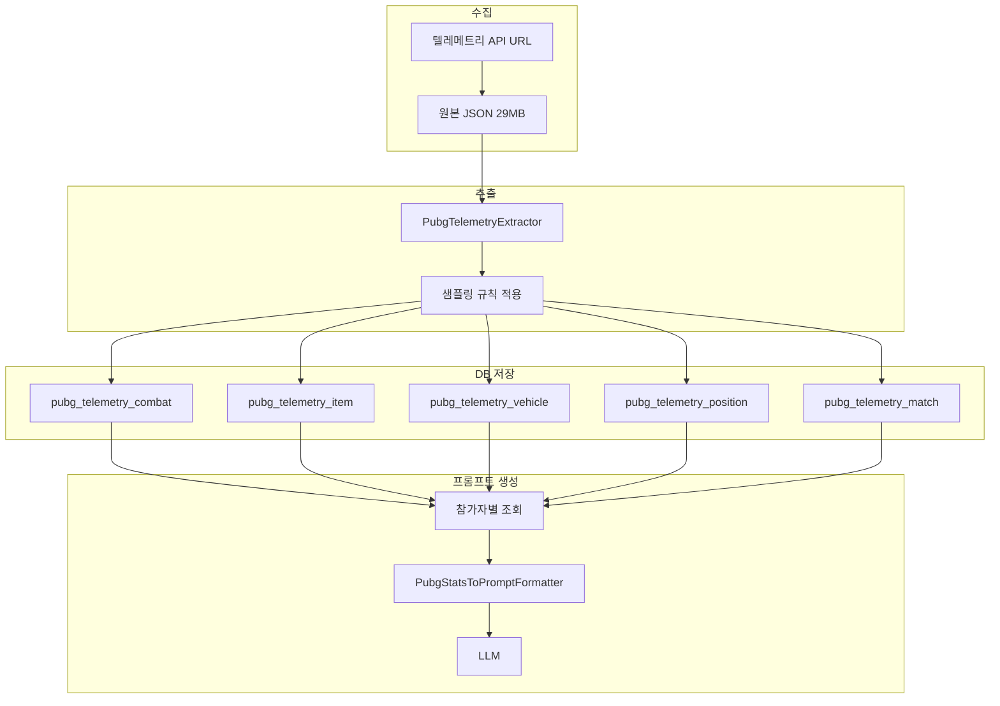

# PUBG 텔레메트리 DB 저장 계획

> [PUBG_TELEMETRY_SAMPLING_RULES.md](PUBG_TELEMETRY_SAMPLING_RULES.md)는 **프롬프트에 넣을 데이터**의 샘플링·가공 규칙을 정의합니다.
> 본 문서는 **그 데이터를 DB에 어떻게 저장할지**에 대한 계획입니다.

---

## 1. 전체 흐름



- **수집**: 매치 API `included`의 asset URL에서 텔레메트리 JSON 다운로드
- **추출**: 스트리밍 파싱 + [샘플링 규칙](PUBG_TELEMETRY_SAMPLING_RULES.md) 적용 → DB에 넣을 이벤트만 선별
- **저장**: 카테고리별 테이블에 정규화하여 저장
- **프롬프트**: 참가자별로 조회 → 포맷터 → LLM

---

## 2. 저장 전략: 추출 후 정규화 저장

**원본 29MB 전체를 저장하지 않음.** 샘플링 규칙을 적용한 결과만 DB에 저장합니다.

| 구분 | 설명 |
|------|------|
| **저장 시점** | 텔레메트리 파싱 직후, 샘플링 규칙을 거친 이벤트만 |
| **저장 단위** | 이벤트별 row (정규화) |
| **참조** | `pubg_match.id` (FK), `account_id` (participant 식별) |

---

## 3. 테이블 설계

### 3.1 공통 컬럼

모든 텔레메트리 테이블에 공통:

| 컬럼 | 타입 | 설명 |
|------|------|------|
| `id` | BIGINT PK | 자동 증가 |
| `match_id` | BIGINT FK | `pubg_match.id` |
| `event_timestamp` | DATETIME(3) | 이벤트 시각 (`_D` 파싱) |
| `elapsed_time` | INT | 매치 시작 후 경과 초 (선택) |

### 3.2 pubg_telemetry_combat (교전)

**이벤트**: LogPlayerAttack, LogPlayerTakeDamage, LogPlayerMakeGroggy, LogPlayerKill, LogPlayerKillV2, LogHeal

| 컬럼 | 타입 | 설명 |
|------|------|------|
| `id` | BIGINT PK | |
| `match_id` | BIGINT FK | |
| `event_type` | VARCHAR(30) | attack, take_damage, make_groggy, kill, kill_v2, heal |
| `event_timestamp` | DATETIME(3) | |
| `attacker_account_id` | VARCHAR(80) | 공격자/힐러 (NULL 가능) |
| `attacker_team_id` | INT | 공격자 팀 ID ("우리 팀이 밀리는가" 분석용) |
| `victim_account_id` | VARCHAR(80) | 피격자/피킬자 (NULL 가능) |
| `victim_team_id` | INT | 피격자 팀 ID |
| `damage` | DECIMAL(10,2) | 데미지량 |
| `damage_reason` | VARCHAR(30) | damageReason |
| `damage_causer_name` | VARCHAR(100) | 무기/원인 |
| `distance` | DECIMAL(10,2) | 거리(m) |
| `weapon_id` | VARCHAR(100) | 무기 ID |
| `heal_amount` | INT | LogHeal 시 회복량 |
| `payload` | JSON | character, extra 등 가변 필드 |

**인덱스**: `(match_id, event_timestamp)`, `(match_id, victim_account_id)`, `(match_id, attacker_account_id)`

---

### 3.3 pubg_telemetry_item (아이템)

**이벤트**: LogItemPickup, LogItemDrop, LogItemEquip, LogItemUnequip, LogItemUse, LogItemAttach, LogItemDetach  
**샘플링**: 30초당 1개 (파밍 구간)

| 컬럼 | 타입 | 설명 |
|------|------|------|
| `id` | BIGINT PK | |
| `match_id` | BIGINT FK | |
| `event_type` | VARCHAR(30) | pickup, drop, equip, unequip, use, attach, detach |
| `event_timestamp` | DATETIME(3) | |
| `account_id` | VARCHAR(80) | 행위자 |
| `item_id` | VARCHAR(100) | Item_Weapon_xxx 등 |
| `category` | VARCHAR(50) | Equipment, Consumable 등 |
| `payload` | JSON | character, parentItem 등 |

**인덱스**: `(match_id, account_id, event_timestamp)`

---

### 3.4 pubg_telemetry_vehicle (탈것)

**이벤트**: LogVehicleRide, LogVehicleLeave, LogVehicleDestroy  
**샘플링**: 전체 수집 (건수 적음)

| 컬럼 | 타입 | 설명 |
|------|------|------|
| `id` | BIGINT PK | |
| `match_id` | BIGINT FK | |
| `event_type` | VARCHAR(30) | ride, leave, destroy |
| `event_timestamp` | DATETIME(3) | |
| `account_id` | VARCHAR(80) | 탑승자/공격자 |
| `vehicle_id` | VARCHAR(100) | Vehicle_xxx |
| `ride_distance` | DECIMAL(10,2) | LogVehicleLeave 시 |
| `payload` | JSON | vehicle, distance 등 |

**인덱스**: `(match_id, account_id, event_timestamp)`

---

### 3.5 pubg_telemetry_position (위치)

**이벤트**: LogPlayerPosition (가변 샘플링)  
**샘플링**: [PUBG_TELEMETRY_SAMPLING_RULES.md](PUBG_TELEMETRY_SAMPLING_RULES.md) 3.1–3.2 참고

- 진입: -30초 ~ -10초 → 5초당 1개  
- 교전 중: -10초 ~ +5초 → 1초당 1개  
- 그 외: 20~30초당 1개  

| 컬럼 | 타입 | 설명 |
|------|------|------|
| `id` | BIGINT PK | |
| `match_id` | BIGINT FK | |
| `event_timestamp` | DATETIME(3) | |
| `account_id` | VARCHAR(80) | |
| `location_x` | DECIMAL(12,2) | |
| `location_y` | DECIMAL(12,2) | |
| `location_z` | DECIMAL(12,2) | 수직 위치 (건물 층수, 언덕 등) |
| `elapsed_time` | INT | 매치 시작 후 초 |
| `num_alive_players` | INT | 생존자 수 |
| `is_in_vehicle` | BOOLEAN | |
| `is_in_bluezone` | BOOLEAN | 자기장 안팎 여부 (운영 분석 필수) |

**인덱스**: `(match_id, account_id, event_timestamp)`

---

### 3.6 pubg_telemetry_match (매치 상태)

**이벤트**: LogMatchStart, LogMatchEnd, LogMatchDefinition, LogGameStatePeriodic  
**샘플링**: MatchStart/End/Definition 전체, GameStatePeriodic 60초당 1개

| 컬럼 | 타입 | 설명 |
|------|------|------|
| `id` | BIGINT PK | |
| `match_id` | BIGINT FK | |
| `event_type` | VARCHAR(30) | match_start, match_end, match_definition, game_state |
| `event_timestamp` | DATETIME(3) | |
| `phase` | INT | LogGameStatePeriodic phase |
| `safe_zone_radius` | DECIMAL(10,2) | 자기장 반경 (이동 효율 분석용) |
| `safe_zone_x` | DECIMAL(12,2) | 자기장 중심 X |
| `safe_zone_y` | DECIMAL(12,2) | 자기장 중심 Y |
| `payload` | JSON | mapName, blueZone, characters 등 |

**인덱스**: `(match_id, event_timestamp)`

---

## 4. 참가자별 프롬프트 데이터 조회

AI 분석은 **참가자(account_id) 단위**로 수행됩니다. 한 참가자에 대한 프롬프트용 데이터는 다음처럼 조회합니다.

```sql
-- 1. 교전 (내가 가담한 것: 공격자 또는 피격자)
SELECT * FROM pubg_telemetry_combat
WHERE match_id = ? AND (attacker_account_id = ? OR victim_account_id = ?)
ORDER BY event_timestamp;

-- 2. 위치 (내 이동)
SELECT * FROM pubg_telemetry_position
WHERE match_id = ? AND account_id = ?
ORDER BY event_timestamp;

-- 3. 아이템 (내 행위)
SELECT * FROM pubg_telemetry_item
WHERE match_id = ? AND account_id = ?
ORDER BY event_timestamp;

-- 4. 탈것 (내 행위)
SELECT * FROM pubg_telemetry_vehicle
WHERE match_id = ? AND account_id = ?
ORDER BY event_timestamp;

-- 5. 매치 메타 (공통)
SELECT * FROM pubg_telemetry_match
WHERE match_id = ?
ORDER BY event_timestamp;
```

이 결과를 `PubgStatsToPromptFormatter`에 넘겨 [의미 텍스트](PUBG_TELEMETRY_SAMPLING_RULES.md#42-좋은-예-의미-부여)로 가공한 뒤 LLM에 전달합니다.

---

## 5. 엔티티 매핑 (JPA)

| 테이블 | 엔티티 클래스 | 패키지 |
|--------|---------------|--------|
| pubg_telemetry_combat | PubgTelemetryCombat | entity.match.pubg |
| pubg_telemetry_item | PubgTelemetryItem | entity.match.pubg |
| pubg_telemetry_vehicle | PubgTelemetryVehicle | entity.match.pubg |
| pubg_telemetry_position | PubgTelemetryPosition | entity.match.pubg |
| pubg_telemetry_match | PubgTelemetryMatch | entity.match.pubg |

모든 엔티티는 `PubgMatch`와 `@ManyToOne` 관계를 갖습니다.

---

## 6. MatchRecord 연동 (선택)

AI 평가 도메인(`MatchRecord`, `MatchRecordParticipant`)과 연동할 경우:

- `MatchRecord` 생성 시 `match_id`로 `pubg_match` 참조
- `MatchRecordParticipant.rawStats`에는 **캐시된 프롬프트용 요약**을 JSON으로 저장 가능
  - 매번 5개 테이블을 조회하지 않고, 최초 추출 시 한 번 포맷해 두고 재사용
- 또는 매번 위 5개 테이블을 조회해 실시간 포맷 (데이터 변경·규칙 변경 대응에 유리)

---

## 7. 저장 성능 (Bulk Insert)

매치당 수백 row가 발생하므로 JPA `saveAll()` 단건 insert는 병목이 됩니다.

| 방식 | 권장 |
|------|------|
| **JdbcTemplate.batchUpdate()** | 권장. 배치 단위로 INSERT |
| **GenerationType.SEQUENCE** | MySQL 대신 PostgreSQL 사용 시 배치 insert 가능 |
| **IDENTITY + saveAll()** | MySQL에서 배치 미지원, 비권장 |

**구현**: `PubgTelemetrySaveService`에서 `JdbcTemplate.batchUpdate()` 또는 `EntityManager` + `persist` 배치(배치 크기 50~100) 사용.

---

## 8. 구현 순서

1. **엔티티 및 마이그레이션**: 5개 테이블 생성
2. **PubgTelemetryExtractor**: 스트리밍 파싱 + 샘플링 규칙 적용
3. **Repository**: 각 엔티티별 JpaRepository
4. **저장 서비스**: Extractor 결과 → **Bulk Insert** (JdbcTemplate 또는 배치 persist)
5. **조회 서비스**: 참가자별 5개 테이블 조회 → DTO 변환
6. **PubgStatsToPromptFormatter**: DTO → 의미 텍스트 ([좌표→지역 변환](PUBG_MAP_REGION_MAPPING.md), 수직성 태그 포함)
7. **PubgEvaluationPromptBuilder**: Valorant/LoL 패턴 적용
