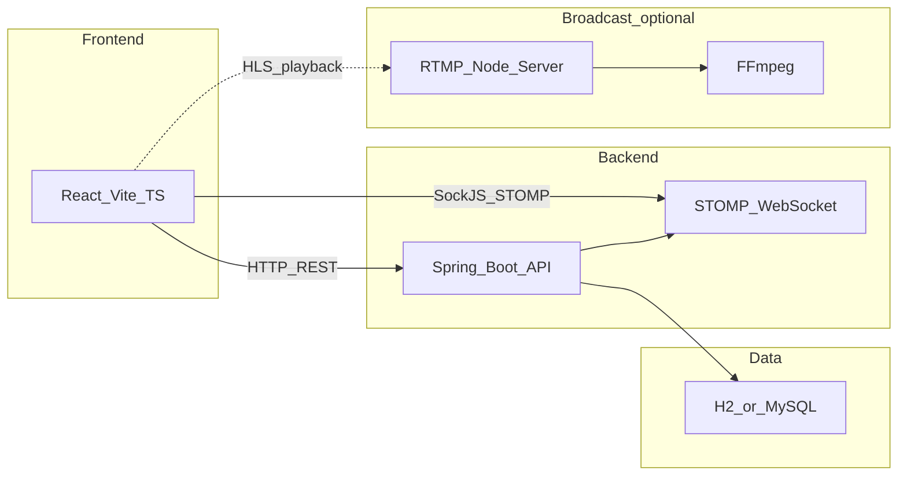

# GameMatcher 기술 스택 · 발표 정리

게임 팀 매칭·방송·채팅을 위한 풀스택 웹 애플리케이션입니다. **메인 API는 Spring Boot**이며, Node.js는 **RTMP 수신 후 HLS 변환**용 보조 서버(`rtmp-server`)에서만 사용합니다. (일반적인 Node + Express 단일 백엔드 구조와는 다릅니다.)

---

## 청중별로 말하기 순서

**비개발자·초기 스크리닝**

- 프론트: React, 빌드는 Vite.
- 백엔드: Java Spring Boot로 REST API와 실시간(채팅 등) 연결.
- 데이터: 개발은 H2, 운영·로컬 MySQL 선택.
- 추가: OAuth 소셜 로그인, 방송은 OBS→RTMP→브라우저 HLS 재생.

**개발자 면접·기술 발표**

- 위에 더해: Spring Data JPA·QueryDSL, Spring Security·OAuth2(Google/Kakao/Naver), WebSocket은 **STOMP**(프론트는 SockJS·`@stomp/stompjs`).
- 프론트: TypeScript, React Router, Firebase(전화번호 인증), HLS.js.
- 백엔드 보조: Firebase Admin, OpenAI 연동용 클라이언트(일부 기능).
- 인프라·도구: Maven, Java 17, FFmpeg(RTMP→HLS 시).

---

## 무엇을 넣고, 무엇을 빼나

**넣기 좋음**

- 아키텍처 뼈대: React(Vite) ↔ Spring Boot ↔ DB(H2/MySQL).
- 설계가 드러나는 것: 실시간(STOMP), 인증(OAuth2·세션), 방송 파이프라인(RTMP/HLS), Firebase(전화·클라이언트 인증).

**줄이거나 면접에서만 풀어서**

- QueryDSL, Lombok, 특정 LLM 클라이언트처럼 **구체 라이브러리**는 “검색·복잡 조회·외부 연동” 수준으로 묶어도 됨.

**빼기 좋음**

- Socket.io, Express 단일 API, Sequelize 등 **이 저장소 메인 경로에 없는 스택**은 다른 프로젝트 설명과 섞이지 않게 주의.
- npm·JSON·일반 CSS처럼 스택을 규정하지 않는 당연한 항목.

---

## 본 프로젝트 스택 표

| 구분           | 기술                                                                 | 주요 역할 및 특징                                                                 |
|----------------|----------------------------------------------------------------------|-----------------------------------------------------------------------------------|
| **백엔드**     | Java, Spring Boot, Spring Data JPA, QueryDSL                         | RESTful API 설계 및 도메인·비즈니스 로직 처리                                     |
| **보안·인증**  | Spring Security, OAuth2, Firebase Admin                             | 구글·카카오·네이버 소셜 로그인, 세션·권한, Firebase Admin 연동을 통한 인증 보안 강화 |
| **데이터베이스** | MySQL, H2(개발 기본)                                               | 데이터 영속성 관리 및 QueryDSL 기반 동적·복잡 조회 최적화                         |
| **프론트엔드** | React, TypeScript, Vite, React Router, Firebase(전화번호 인증)      | 컴포넌트 기반 UI·반응형 웹, 라우팅 및 클라이언트 인증 연동                         |
| **스트리밍**   | Node Media Server, FFmpeg, HLS.js                                   | RTMP 수신 후 HLS 변환, 웹 플레이어 기반 라이브 송출·재생                           |
| **실시간**     | Spring WebSocket(STOMP), SockJS, `@stomp/stompjs`                    | SockJS 기반 실시간 양방향 채팅·알림 및 상태 동기화                                |

---

## 아키텍처 개요

상세 실행·환경은 저장소 루트의 [README.md](../README.md)를 참고하면 됩니다.
